# Sistema de Gestión Interna El Bambú

## Índice
- [📋 Descripción del Proyecto](#-descripción-del-proyecto)
- [🏪 Sobre el Cliente](#-sobre-el-cliente)
- [🌐 Proyecto Desplegado](#-proyecto-desplegado)
- [💡 ¿Cómo Funciona el Sistema?](#-cómo-funciona-el-sistema)
- [📖 Guía de Uso](#-guía-de-uso)
- [🔧 Tecnologías](#-tecnologías)
- [🚀 Instalación y Configuración](#-instalación-y-configuración)
- [🏗️ Estructura del Proyecto](#️-estructura-del-proyecto)
- [📚 Documentación](#-documentación)
- [🌿 Flujo de Trabajo con Git y Gitflow](#-flujo-de-trabajo-con-git-y-gitflow)
- [❓ Preguntas Frecuentes (FAQ)](#-preguntas-frecuentes-faq)
- [📸 Capturas de Pantalla](#-capturas-de-pantalla)
- [👥 Equipo de Desarrollo](#-equipo-de-desarrollo)
- [⚖️ Derechos de Autor y Términos de Uso](#️-derechos-de-autor-y-términos-de-uso)

## 📋 Descripción del Proyecto

Este proyecto tiene como objetivo desarrollar un sistema de gestión interna para la Soda y Restaurante El Bambú, con el fin de optimizar sus procesos administrativos, financieros y operativos. El proyecto se desarrolla como parte de una evaluación requerida para aprobar los cursos de Ingeniería en Sistemas I, II y III de la Universidad Nacional de Costa Rica, y responde de forma directa a la problemática actual de una empresa pequeña que necesita digitalizar sus procesos.

## 🏪 Sobre el Cliente

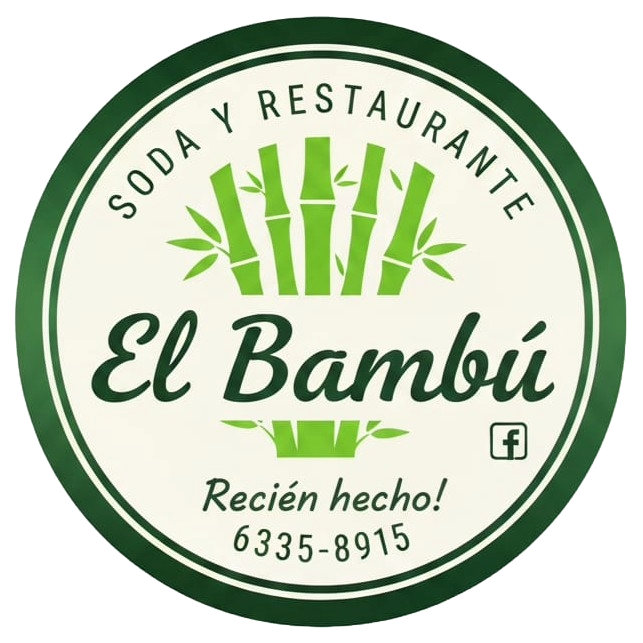

**Soda y Restaurante El Bambú** es un negocio ubicado en Cariari, Pococí, Limón, Costa Rica. Su principal objetivo es ofrecer un servicio de comidas, con una variada selección de platillos y bebidas tipo soda, con un enfoque en ofrecer un servicio accesible, rápido y de calidad a la comunidad.

### 🔍 Problemática Actual
A pesar de ser una empresa pequeña, el restaurante enfrenta limitaciones debido a la falta de digitalización en sus procesos internos. Actualmente el control de ventas, los registros financieros, el cálculo de salarios, la gestión de inventario, las reservas y los reportes operativos se realizan de forma manual, lo que reduce la eficiencia del negocio.

### 🎯 Objetivo del Sistema
Con la implementación del sistema, se busca mejorar la organización interna, optimizar recursos y facilitar una toma de decisiones basada en datos reales. El sistema permitirá a los empleados y administradores gestionar de forma centralizada todas las operaciones del restaurante, desde el punto de venta hasta la administración de inventarios y la generación de reportes financieros.

## 🌐 Proyecto Desplegado

Puedes acceder a la versión en producción del sistema en:

**🔗 [https://proyecto-soda-bambu.vercel.app](https://proyecto-soda-bambu.vercel.app)**

> **Nota:** El sistema se encuentra desplegado en Vercel con una base de datos MySQL en TiDB Cloud.

## 💡 ¿Cómo Funciona el Sistema?

El sistema está diseñado como una aplicación web progresiva (PWA) que permite gestionar todos los procesos internos del restaurante de forma centralizada:

### Arquitectura General
- **Backend**: Laravel procesa todas las peticiones, valida datos y gestiona la lógica de negocio
- **Frontend**: Blade templates + Bootstrap 5 proporcionan una interfaz responsive
- **Base de Datos**: MySQL/SQLite almacena toda la información del negocio
- **Autenticación**: Laravel Fortify maneja el acceso seguro con roles y permisos

### Flujo de Trabajo Típico
1. El usuario se autentica en el sistema según su rol (Administrador/Empleado)
2. Accede a los módulos correspondientes a sus permisos
3. Realiza operaciones CRUD sobre las entidades del negocio
4. El sistema valida, procesa y almacena la información
5. Genera reportes y estadísticas en tiempo real

## 📖 Guía de Uso

### Primer Acceso

1. Accede al sistema a través del [enlace desplegado](https://proyecto-soda-bambu.vercel.app) o en tu entorno local (`http://localhost:8000`)
2. Inicia sesión con tus credenciales proporcionadas por el Administrador
3. Verifica tu correo electrónico (si es requerido)

> **Nota:** La verificación del correo solamente se realiza la primera vez que el usuario inicia sesión (después de que el Administrador lo haya creado). Si es tu primera vez accediendo, utiliza las credenciales de prueba proporcionadas a continuación.

### Usuarios de Prueba

Para probar el sistema con datos de ejemplo durante el desarrollo:

> ⚠️ **Importante:** Las credenciales que se muestran a continuación son **únicamente para propósitos de prueba** mientras el proyecto se encuentra en fase de desarrollo. Una vez que el proyecto esté completado, el cliente proporcionará credenciales reales que reemplazarán estos datos de prueba.

**Credenciales de prueba (temporales):**
- **Administrador**: 
  - Email: `admin@admin.com`
  - Contraseña: `admin1234`
- **Empleado**: 
  - Email: `juan.perez@sodabambu.com`
  - Contraseña: `password123`

#### 🔐 Modelo de Acceso

El sistema **no cuenta con un sistema público de registro de usuarios**. El acceso se controla de la siguiente manera:

- **Creación de usuarios**: Solo el Administrador puede crear nuevos usuarios en el sistema
- **Gestión de acceso**: El Administrador asigna roles y permisos a cada usuario
- **Credenciales**: Cada usuario recibe sus credenciales del Administrador para acceder al sistema

Esta estructura garantiza el control y la seguridad del acceso al sistema.

### Funcionalidades Principales

En el sistema, las funcionalidades se organizan en módulos según el rol del usuario:

> **Nota:** Muchas de las funcionalidades aún están en desarrollo, por lo que es posible que algunas de las funciones mencionadas a continuación no estén disponibles en la versión actual del sistema. Sin embargo, se espera que estas funcionalidades estén implementadas y operativas en futuras versiones del proyecto.

#### 👤 Para Administradores

1. **Gestión de Usuarios**
   - Navega a "Usuarios" desde el menú lateral
   - Crea, edita o elimina cuentas de empleados
   - Asigna roles

2. **Gestión de Clientes**
   - Accede al módulo "Clientes"
   - Registra nuevos clientes con su información de contacto
   - Consulta el historial de pedidos por cliente

3. **Gestión de Proveedores**
   - Administra la información de proveedores
   - Mantén actualizado el catálogo de contactos

4. **Categorías y Productos**
   - Organiza el inventario por categorías
   - Define precios, stock mínimo y descripciones

5. **Reportes y Dashboard**
   - Visualiza estadísticas de ventas
   - Genera reportes financieros y operativos
   - Monitorea el estado del inventario

#### 💼 Para Empleados

1. **Punto de Venta**
   - Registra ventas de forma rápida
   - Selecciona productos del catálogo
   - Procesa diferentes métodos de pago

2. **Consulta de Inventario**
   - Verifica disponibilidad de productos
   - Notifica productos con stock bajo
  
> **Nota:** Las funcionalidades disponibles pueden variar según el rol asignado a cada usuario. Asegúrate de iniciar sesión con el rol correcto para acceder a las funciones correspondientes.

### Navegación General

- **Menú Lateral**: Accede a todos los módulos del sistema
- **Botones de Acción**: ➕ Crear, ✏️ Editar, ℹ️ Ver Detalles, 🗑️ Eliminar

### Características Especiales

- **🌓 Tema Oscuro/Claro**: Cambia el tema según tu preferencia
- **📊 Exportación de Datos**: Descarga reportes en PDF, Excel o CSV
- **🔔 Notificaciones**: Recibe alertas de stock bajo, pedidos pendientes, etc.

## 🔧 Tecnologías

### Backend
- **PHP**: >= 8.2
- **Framework**: Laravel ^12.x (PHP)
- **Base de datos**: MySQL/SQLite
- **Autenticación**: Laravel Fortify

### Frontend
- **Templates**: Laravel Blade
- **CSS Framework**: Bootstrap 5
- **JavaScript**: Vanilla JS + jQuery

### Deployment
- **Hosting de la Aplicación**: Vercel
- **Servidor de Base de Datos**: TiDB Cloud

### Herramientas de Desarrollo
- **Control de versiones**: Git + Gitflow
- **Gestor de dependencias PHP**: Composer
- **Gestor de dependencias JS**: npm
- **Entorno de desarrollo**: XAMPP / Laragon
- **IDE recomendado**: Visual Studio Code / PHPStorm

## 🚀 Instalación y Configuración

### Requisitos Previos
- PHP >= 8.2
- Composer
- Node.js y NPM
- MySQL/SQLite
- Git

### Pasos de Instalación

1. **Clonar el repositorio**
   ```bash
   git clone [URL-del-repositorio]
   cd ProyectoSodaBambu
   cd source_code
   ```

2. **Configurar la Base de Datos**

   Elige uno de los siguientes motores de base de datos según tus necesidades:

   #### Opción A: SQLite (Recomendado para desarrollo local)
   ```bash
   composer workspace:sqlite
   ```

   #### Opción B: MySQL (Recomendado para entornos de producción)
   
   > ⚠️ **Importante:** Asegúrate de que el servidor de base de datos (XAMPP/Laragon) esté funcionando correctamente antes de continuar. Además, verifica que el puerto configurado para MySQL no esté siendo utilizado por otro servicio y que la base de datos (`laravel_db` por defecto) esté creada y sea accesible con las credenciales proporcionadas.

   **Con valores personalizados:**
   ```bash
   composer workspace:mysql -- --db-host 127.0.0.1 --db-port 3306 --db-name laravel_db --db-user root --db-password su_contrasena
   ```

   **Con valores por defecto:**
   ```bash
   composer workspace:mysql
   ```

   Los valores por defecto para MySQL son:
   - `db-host`: 127.0.0.1
   - `db-port`: 3306
   - `db-name`: laravel_db
   - `db-user`: root
   - `db-password`: (vacío)

   Puedes omitir cualquiera de los argumentos para usar los valores por defecto indicados arriba.

3. **Poblar la Base de Datos (opcional)**

   Para cargar datos de prueba en la base de datos:

   ```bash
   # SQLite
   composer workspace:sqlite:fresh:seed

   # MySQL
   composer workspace:mysql:fresh:seed
   ```

   **Credenciales de prueba:**
   - Email: `admin@admin.com`
   - Contraseña: `admin1234`

4. **Iniciar el servidor de desarrollo**
   ```bash
   composer run dev
   ```

5. **Acceder a la aplicación**
   
   Abre tu navegador en: `http://localhost:8000`

### Comandos Adicionales

Para cargar los datos de prueba sin limpiar la base de datos existente, utiliza:

```bash
composer workspace:[db]:seed
```

Para limpiar la base de datos y volver a cargar los datos de prueba, utiliza:

```bash
composer workspace:[db]:fresh:seed
```

> Reemplaza `[db]` con `sqlite` o `mysql` según tu configuración.

## 🏗️ Estructura del Proyecto

```
ProyectoSodaBambu/
├── assets/                            # Recursos estáticos
│   ├── icons/                         # Iconos del proyecto
│   └── images/                        # Imágenes y logos
├── docs/                              # Documentación del proyecto
│   ├── Documento de Casos de Uso.docx
│   ├── Documento de Especificación de Requisitos de Software.docx
│   ├── Documento de Reglas de Negocio.docx
│   ├── Documento de Visión y Alcance.docx
│   └── IngenieriaII/                  # Documentación específica del ciclo II
├── legal/                             # Documentos legales y contratos
│   ├── Carta de Intenciones (contrato).docx
│   ├── Carta de Intenciones (firmado).pdf
│   ├── Codigo de Ética (firmado).pdf
│   └── Código de Ética.docx
├── scripts/                           # Scripts de automatización
│   ├── database/                      # Scripts de base de datos
│   └── deployment/                    # Scripts de despliegue
├── source_code/                       # Código fuente Laravel
│   ├── api/                           # Configuración redireccionamiento para despliegue
│   ├── app/                           # Lógica de la aplicación
│   ├── config/                        # Archivos de configuración
│   ├── database/                      # Migraciones y seeders
|   ├── lang/                          # Archivos de idioma
│   ├── public/                        # Archivos públicos
│   ├── resources/                     # Vistas y assets
│   ├── routes/                        # Definición de rutas
│   └── .env.example                   # Plantilla de variables de entorno
├── uml/                               # Diagramas UML
│   ├── activity_diagrams/             # Diagramas de actividad
│   ├── class_diagrams/                # Diagramas de clases
│   ├── sequence_diagrams/             # Diagramas de secuencia
│   ├── state_diagrams/                # Diagramas de estado
│   └── use_case_diagrams/             # Diagramas de casos de uso
└── README.md                          # Este archivo
```

## 📚 Documentación

### Documentos de Análisis y Diseño
- **Documento de Visión y Alcance**: Define el propósito, objetivos y límites del proyecto
- **Documento de Especificación de Requisitos de Software**: Detalla los requisitos funcionales y no funcionales
- **Documento de Casos de Uso**: Describe las interacciones entre los usuarios y el sistema
- **Documento de Reglas de Negocio**: Establece las reglas y políticas del negocio

### Documentos Legales
- **Carta de Intenciones**: Acuerdo formal con el cliente
- **Código de Ética**: Principios éticos que rigen el desarrollo del proyecto

## 🌿 Flujo de Trabajo con Git y Gitflow

### Configuración Inicial de Gitflow

Si es tu primera vez trabajando en el proyecto, configura Gitflow:

```bash
git flow init
```

- **Rama de producción**: `main`
- **Rama de desarrollo**: `dev`
- Acepta los nombres por defecto para features, releases y hotfixes

### Comandos Principales

#### 1. Trabajar en una Nueva Funcionalidad (Feature)

```bash
# Crear una nueva feature
git flow feature start nombre-de-la-feature

# Trabajar en tus cambios
git add .
git commit -m "Descripción del cambio"

# Subir la feature a GitHub
git push origin feature/nombre-de-la-feature
```

**Importante:** Crea un **Pull Request** en GitHub de `feature/nombre-de-la-feature` → `dev`

#### 2. Lanzar una Nueva Versión (Release)

```bash
# Iniciar una release
git flow release start v1.0.0

# Hacer ajustes finales (versiones, documentación, etc.)
git add .
git commit -m "Preparar release v1.0.0"

# Subir y crear PR
git push origin release/v1.0.0
```

Crea **dos** Pull Requests: primero de `release/v1.0.0` → `main` para publicar la versión, y **después SIEMPRE** sincroniza `dev` creando un PR de `main` → `dev` una vez que la release haya sido aprobada y mergeada. Esto evita que `dev` se quede atrasado respecto a `main`.

#### 3. Correcciones Urgentes en `main` (Hotfix)

```bash
# Iniciar un hotfix desde main
git flow hotfix start fix-descripcion

# Hacer correcciones
git add .
git commit -m "Fix: descripción del problema"

# Subir y crear PR
git push origin hotfix/fix-descripcion
```

Crea un Pull Request de `hotfix/fix-descripcion` → `main`. Una vez aprobado y fusionado, sincroniza también `main` → `dev` para que la corrección no se pierda en futuras releases.

### Reglas de Oro del Proyecto

1. ✅ **SIEMPRE** trabaja en una rama feature/release/hotfix
2. ❌ **NUNCA** hagas push directo a `main` o `dev`
3. ✅ **TODOS** los cambios deben pasar por Pull Request
4. ✅ **ESPERA** la aprobación del PR antes de hacer merge
5. ✅ Mantén tu rama actualizada con `dev`:
   
   ```bash
   git checkout dev
   git pull origin dev
   git checkout feature/tu-feature
   git merge dev
   ```

### Convenciones de Commits

Usa mensajes descriptivos en **inglés**:

```bash
# Buenos ejemplos
git commit -m "Add user authentication"
git commit -m "Fix total calculation error"
git commit -m "Update installation documentation"

# Evitar
git commit -m "fix"
git commit -m "cambios"
git commit -m "update"
```

### Eliminación de Ramas

Después de hacer `merge` a un PR, elimina la rama:

```bash
# Eliminar localmente
git branch -d feature/nombre-de-la-feature

# Eliminar en GitHub
git push origin --delete feature/nombre-de-la-feature
```

### Comandos Útiles de Git

```bash
# Ver estado actual
git status

# Ver ramas locales
git branch

# Ver ramas remotas
git branch -r

# Cambiar de rama
git checkout nombre-rama

# Actualizar desde remoto
git pull origin nombre-rama

# Ver historial de commits
git log --oneline --graph --all

# Deshacer cambios no commiteados
git checkout -- .

# Ver diferencias
git diff
```

### Resolución de Conflictos

Si encuentras conflictos al hacer merge:

1. Abre los archivos en conflicto en VS Code
2. Resuelve los conflictos manualmente (VS Code te ayudará)
3. Marca los cambios como resueltos ejecutando:
   
   ```bash
   git add .
   git commit -m "Resolver conflictos de merge"
   ```

## ❓ Preguntas Frecuentes (FAQ)

<details>
<summary><strong>¿Cómo recupero mi contraseña?</strong></summary>

En la página de inicio de sesión, haz clic en "¿Olvidaste tu contraseña?" e ingresa tu correo electrónico. Recibirás un enlace para restablecer tu contraseña.
</details>

<details>
<summary><strong>¿Puedo usar el sistema en mi teléfono móvil?</strong></summary>

No, el sistema únicamente está diseñado para su uso en computadoras de escritorio o laptops, no está diseñado para su uso en dispositivos móviles
</details>

<details>
<summary><strong>¿El sistema funciona sin internet?</strong></summary>

No, el sistema requiere conexión a internet para funcionar. La arquitectura PWA está diseñada para que no sea necesario abrir un navegador tradicional para acceder a la aplicación, permitiendo instalarla como una aplicación nativa en el dispositivo.
</details>

## 📸 Capturas de Pantalla

A continuación, se muestran capturas de pantalla del sistema en sus dos temas disponibles: **oscuro** y **claro**.

> **Nota:** Las siguientes capturas son solo ejemplos de algunas de las pantallas del sistema. El sistema completo incluye muchas más funcionalidades y pantallas que se irán implementando a lo largo del desarrollo del proyecto. Cabe aclarar que algunas las funcionalidades mostradas en las capturas de pantalla todavía se encuentran en desarrollo, por lo que es posible que se lleguen a realizar cambios en el diseño o en la funcionalidad de estas pantallas a medida que se avance en el desarrollo del proyecto. Sin embargo, se espera que todas las funcionalidades mostradas en las capturas de pantalla estén implementadas y operativas en futuras versiones del sistema.

### 🔐 Pantalla de Inicio de Sesión

<div style="display: flex; gap: 20px; justify-content: center; align-items: flex-start;">
  <div style="flex: 1; text-align: center;">
    <h5>Tema Oscuro</h5>
    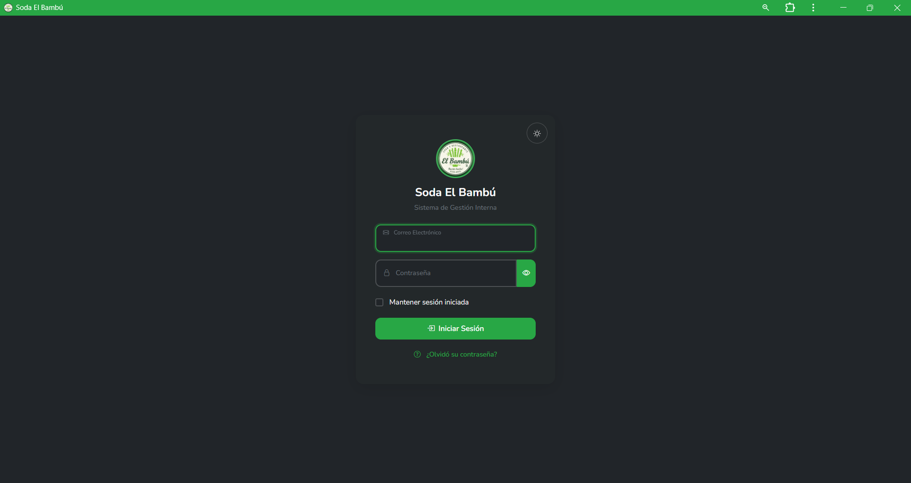
  </div>
  <div style="flex: 1; text-align: center;">
    <h5>Tema Claro</h5>
    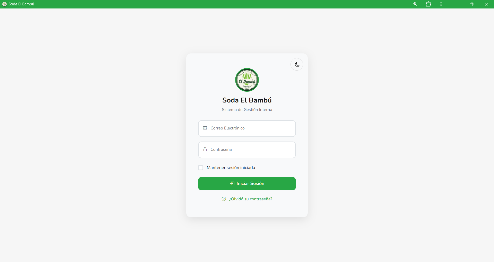
  </div>
</div>

---

### 📊 Dashboard Principal

El panel de control centralizado que muestra el resumen general del sistema.

<div style="display: flex; gap: 20px; justify-content: center; align-items: flex-start;">
  <div style="flex: 1; text-align: center;">
    <h5>Tema Oscuro</h5>
    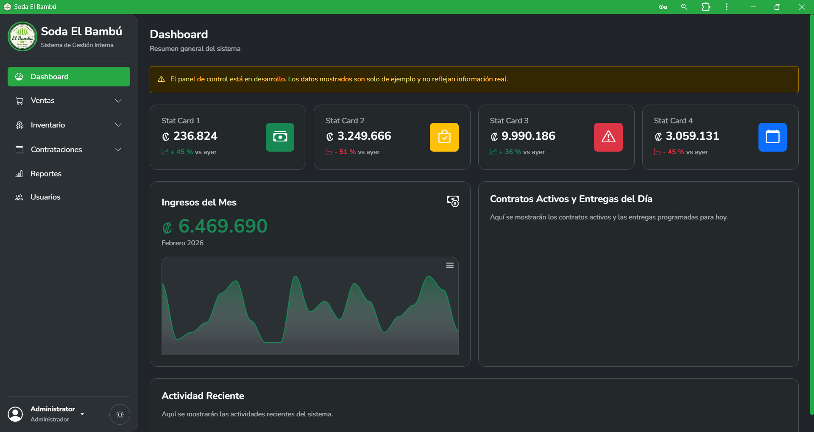
  </div>
  <div style="flex: 1; text-align: center;">
    <h5>Tema Claro</h5>
    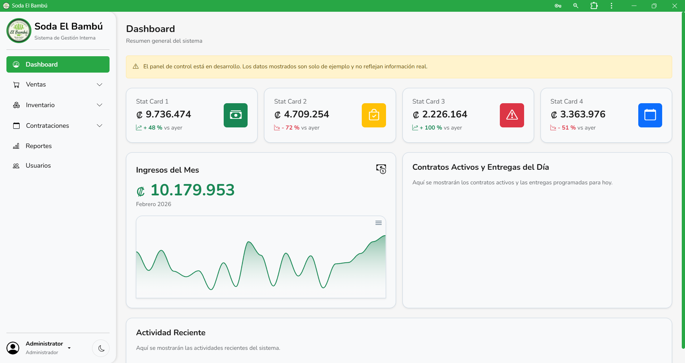
  </div>
</div>

---

### 👥 Gestión de Clientes

Módulo para administrar la información de clientes del restaurante.

<div style="display: flex; gap: 20px; justify-content: center; align-items: flex-start;">
  <div style="flex: 1; text-align: center;">
    <h5>Tema Oscuro</h5>
    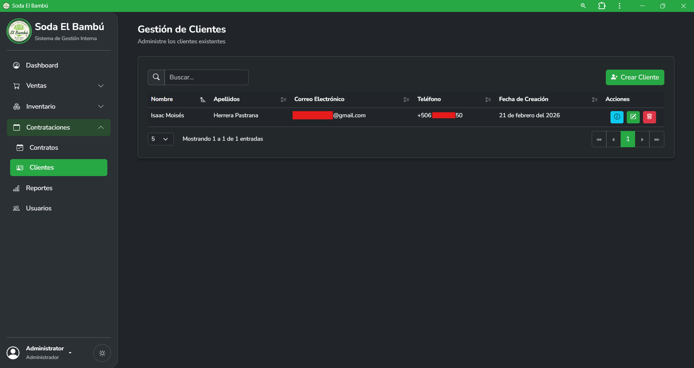
  </div>
  <div style="flex: 1; text-align: center;">
    <h5>Tema Claro</h5>
    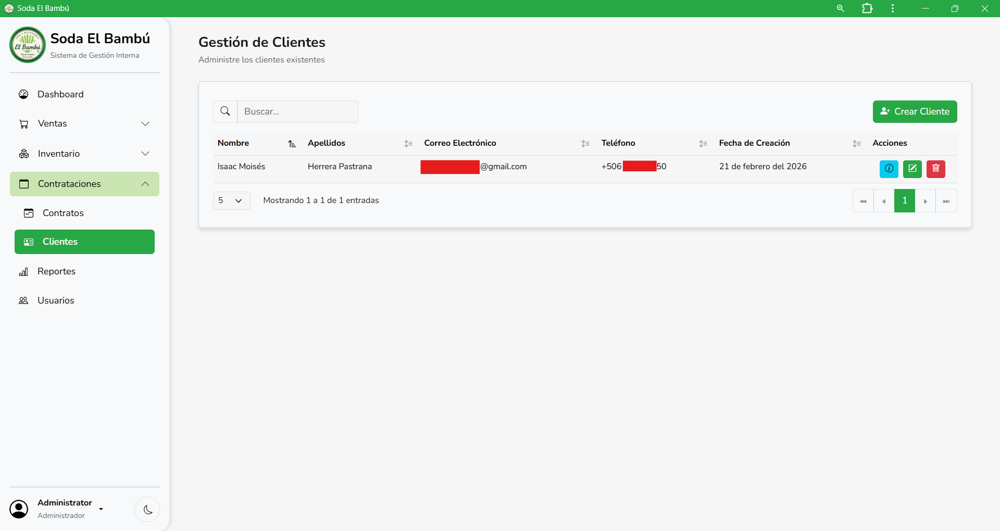
  </div>
</div>

---

### 🏢 Gestión de Proveedores

Administración centralizada de proveedores e información de contacto.

<div style="display: flex; gap: 20px; justify-content: center; align-items: flex-start;">
  <div style="flex: 1; text-align: center;">
    <h5>Tema Oscuro</h5>
    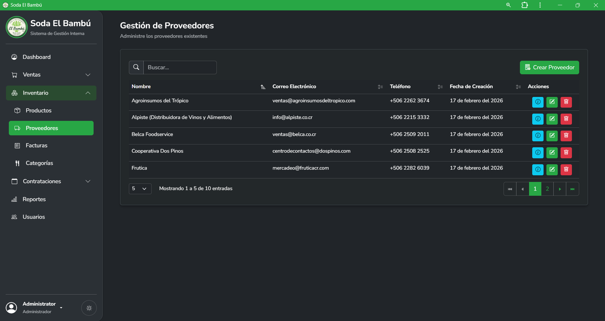
  </div>
  <div style="flex: 1; text-align: center;">
    <h5>Tema Claro</h5>
    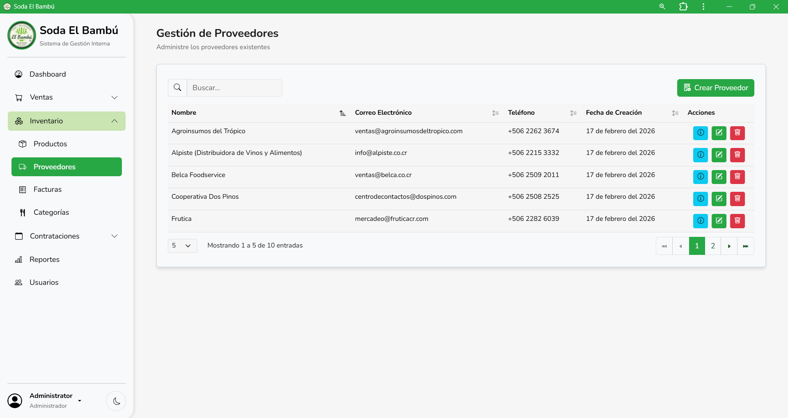
  </div>
</div>

---

### 👤 Gestión de Usuarios

Control de acceso y administración de cuentas de usuario del sistema.

<div style="display: flex; gap: 20px; justify-content: center; align-items: flex-start;">
  <div style="flex: 1; text-align: center;">
    <h5>Tema Oscuro</h5>
    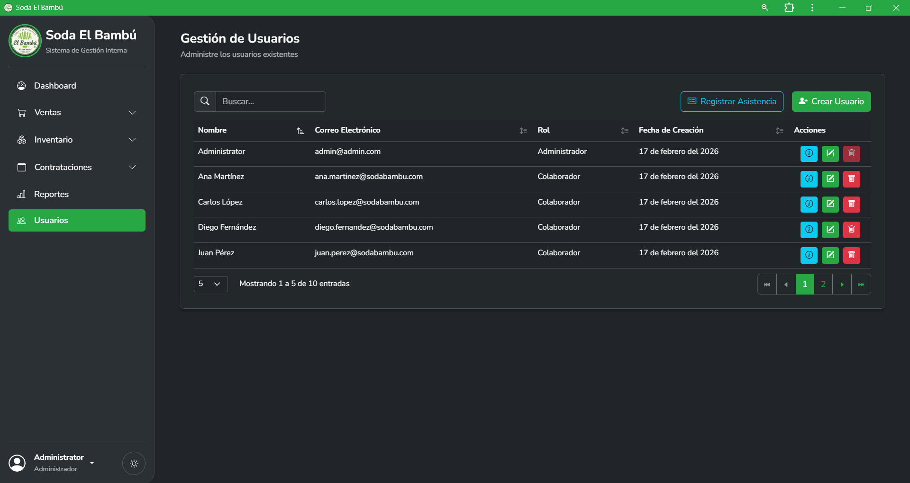
  </div>
  <div style="flex: 1; text-align: center;">
    <h5>Tema Claro</h5>
    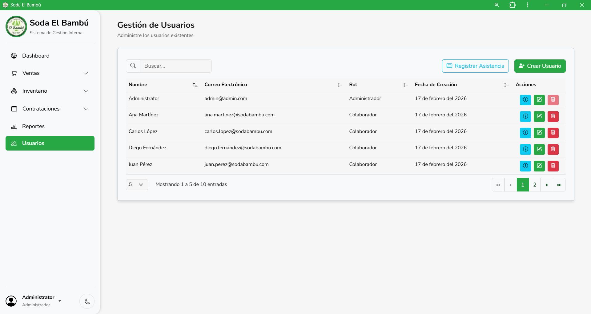
  </div>
</div>

> **Nota:** Todas las pantallas pueden ser visualizadas en tema oscuro o claro según la preferencia del usuario.

---

### Scripts Disponibles

Revisa la carpeta [scripts/](scripts/) para:
- **scripts/database/**: Scripts de base de datos (backups)
- **scripts/deployment/**: Scripts de despliegue y configuración de producción

## 👥 Equipo de Desarrollo

### 🎓 Estudiantes Desarrolladores
| Nombre | Correo Institucional | GitHub |
| ------ | ------ | ------ |
| Isaac Herrera Pastrana | isaac.herrera.pastrana@est.una.ac.cr   | [@Moshe9647](https://github.com/Moshe9647) |
| Melanie Oviedo Maleaño | melanie.oviedo.maleano@est.una.ac.cr   | [@MelanieOviedo](https://github.com/MelanieOviedo) |
| Natalia Ortiz Martinez | deyaneira.ortiz.martinez@est.una.ac.cr | [@DeyaneiraOrtizMartinez](https://github.com/DeyaneiraOrtizMartinez) |
| Andrea Morera Zúñiga   | andrea.morera.zuniga@est.una.ac.cr     | [@AndreMoreZu](https://github.com/AndreMoreZu) |
| Jeremy Romero Carazo   | jeremy.romero.carazo@est.una.ac.cr     | [@Romero42](https://github.com/Romero42) |

### 👨‍🏫 Supervisión Académica
- **Ingeniería en Sistemas I**: M.Sc. Olivier Blanco Sandí
- **Ingeniería en Sistemas II**: Prof. Adán Carranza Alfaro
- **Ingeniería en Sistemas III**: Prof. Michael Barquero Salazar

## ⚖️ Derechos de Autor y Términos de Uso

### 🎓 Proyecto Académico
Este sistema fue desarrollado como proyecto académico del curso de **Ingeniería en Sistemas I, II y III** de la Universidad Nacional de Costa Rica durante el **I y II Ciclo 2025** y el **I Ciclo 2026**.

### 👥 Autoría y Desarrollo
- **Desarrollado por**: Equipo de estudiantes de Ingeniería en Sistemas (ver sección "Equipo de Desarrollo").
- **Supervisión académica**: M.Sc. Olivier Blanco Sandí (Ingeniería I), Prof. Adán Carranza Alfaro (Ingeniería II) y Prof. Prof. Michael Barquero Salazar (Ingeniería III).
- **Institución**: Universidad Nacional de Costa Rica, Sección Regional Huetar Norte y Caribe.
- **Período actual**: I Ciclo 2026 (Ingeniería en Sistemas II).
- **Proyecto completo**: I y II Ciclo 2025, I Ciclo 2026 (Ingeniería I, II y III).

### 🏪 Cliente y Propósito
- **Cliente**: Soda y Restaurante El Bambú.
- **Ubicación**: Cariari, Pococí, Limón, Costa Rica.
- **Propósito**: Sistema de gestión interna para digitalizar y optimizar los procesos del establecimiento.
- **Derechos de uso comercial**: Según lo establecido en la Carta de Intenciones firmada.

### 📋 Términos de Uso
1. **Uso Académico**: Este proyecto puede ser referenciado con fines académicos citando apropiadamente la autoría y la institución.
2. **Uso Comercial**: Los derechos de uso comercial del sistema pertenecen a Soda y Restaurante El Bambú según el acuerdo establecido en los documentos legales del proyecto.
3. **Modificaciones**: Cualquier modificación al sistema debe ser autorizada por los autores originales y/o el cliente.
4. **Distribución**: La distribución del código está restringida según los términos del acuerdo con el cliente.
5. **Código Fuente**: El acceso al código fuente está limitado a fines académicos y de mantenimiento autorizado.

### 📞 Contacto para Consultas sobre Derechos
Para consultas sobre el uso de este software o derechos de autor:
- **Equipo de desarrollo**: Ver tabla de contactos en la sección "Equipo de Desarrollo"
- **Supervisión académica**: A través de los canales oficiales de la Universidad Nacional de Costa Rica

**© 2025–2026 Equipo de Desarrollo, Universidad Nacional de Costa Rica. Todos los derechos reservados.**

---


**Universidad Nacional de Costa Rica**  
**Escuela de Informática**  
**Ingeniería en Sistemas II**  
**I Ciclo 2026**